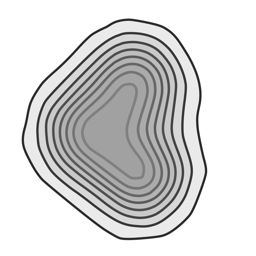
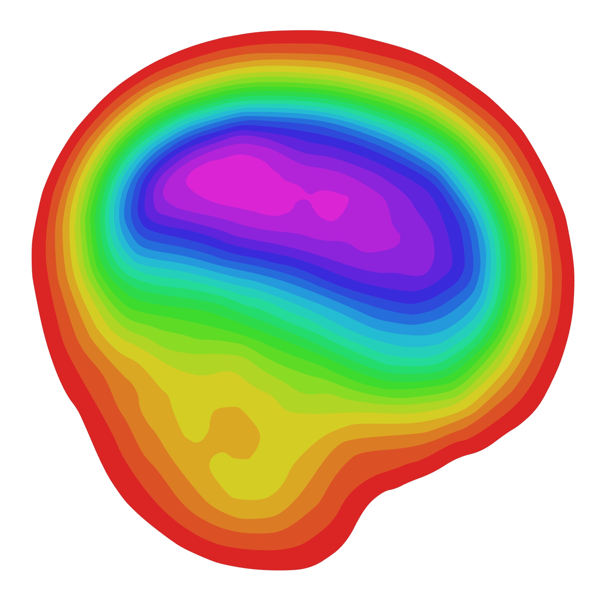
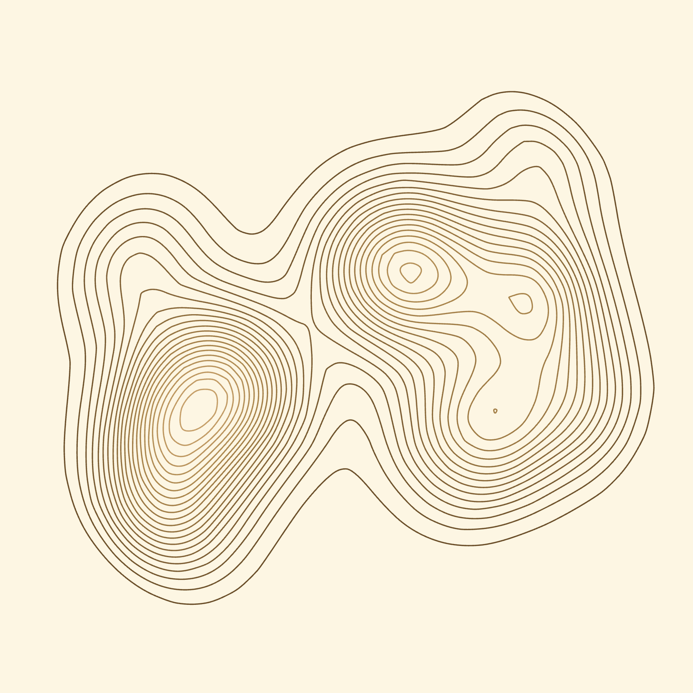
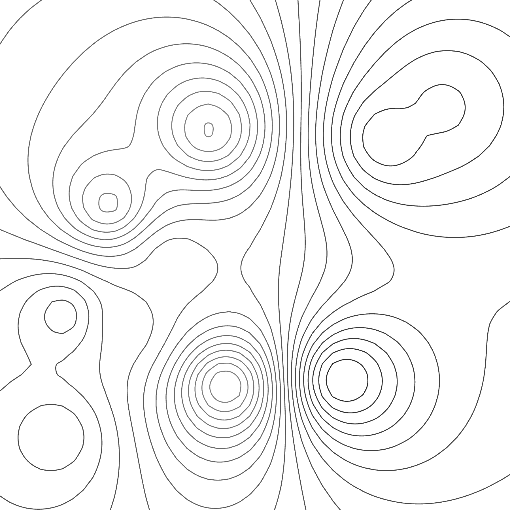
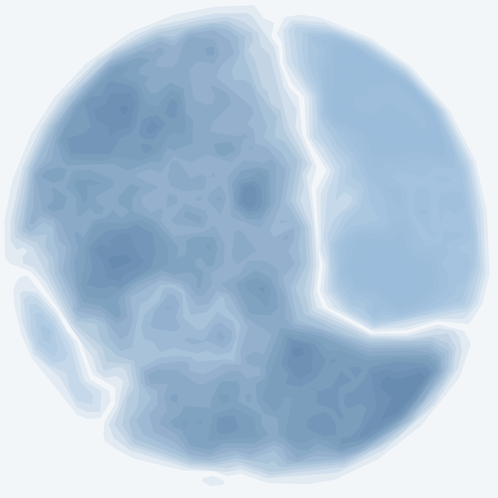

# Parametric Contour Lines Generator
### [contours.jacksalici.com](https://contours.jacksalici.com)


<table>
  <tr>
    <td></td>
    <td></td>
  </tr>
  <tr>
    <td></td>
    <td></td>
  </tr>
</table>

The purpose of this project is to generate **parametric [contour lines](https://en.wikipedia.org/wiki/Contour_line)** and export them as beautiful images.

## How it works

Contour lines are [level sets](https://en.wikipedia.org/wiki/Level_set) of a continuous height function
`h(x, y)`. The user only supplies a handful of scattered samples of that surface, so the pipeline reconstructs it first and slices it second:

1. **Control points** `(x, y, z)`: the scattered data, placed and dragged on the canvas, in normalised
   `[0,1]²` coordinates. Everything downstream is derived from them, so the whole image is one small
   parameter set, and it fits in a URL.
2. **Scalar field**: `h` is evaluated on a regular grid of `resolution²` samples by
   [scattered-data interpolation](https://en.wikipedia.org/wiki/Multivariate_interpolation#Irregular_grid_(scattered_data)):
   either [inverse distance weighting](https://en.wikipedia.org/wiki/Inverse_distance_weighting) or
   [gaussian radial basis functions](https://en.wikipedia.org/wiki/Radial_basis_function). 
    - *Additive
   bumps* sums the gaussians, so overlapping points build ridges. It's the most terrain-like of the three;
    - *inverse distance* and *gaussian blend* average instead, so the field never exceeds the highest control
   point. Optional [fBm noise](https://en.wikipedia.org/wiki/Fractional_Brownian_motion) roughens the
   surface, and a [smoothstep](https://en.wikipedia.org/wiki/Smoothstep) border mask fades it to zero near
   the frame so contours close into islands instead of being clipped: `radial` gives an oval landmass,
   `frame` gives rings parallel to the border, `none` lets lines run off the edge. The result is rescaled
   to `[0,1]`.
3. **Marching squares**: [the algorithm](https://en.wikipedia.org/wiki/Marching_squares) classifies each
   cell's four corners as above or below the level; the 16 possible configurations say which cell edges
   the contour crosses, and
   [linear interpolation](https://en.wikipedia.org/wiki/Linear_interpolation) between corner values places
   the crossing along the edge. Two configurations are ambiguous [saddles](https://en.wikipedia.org/wiki/Saddle_point), the cell-centre average picks a branch.
4. **Stitching**: the loose segments are joined into continuous [polylines](https://en.wikipedia.org/wiki/Polygonal_chain). Crossings are keyed by the grid edge they
   lie on rather than by coordinates, so adjacent cells agree exactly and no floating-point tolerance is
   involved. Chains with a free end run off the frame; the rest close into loops around peaks and basins.
5. **Simplify & smooth**: [Ramer–Douglas–Peucker](https://en.wikipedia.org/wiki/Ramer%E2%80%93Douglas%E2%80%93Peucker_algorithm)
   drops vertices that stay within a tolerance of the line they sit on, then
   [Chaikin's corner cutting](https://en.wikipedia.org/wiki/Subdivision_surface) rounds the grid-faceted
   polyline into a curve (it converges to a quadratic
   [B-spline](https://en.wikipedia.org/wiki/B-spline)). Simplifying first means smoothing has fewer, longer
   edges to work with, and the exported file stays small.
6. **SVG paths**: the polylines are mapped to pixels and written as
   [SVG](https://en.wikipedia.org/wiki/SVG) `M`/`L` path data, then coloured from the palette.
   *Topographic* and *Paper white* are fixed lists; *Rainbow* and *Single colour* are generated (a hue
   wheel, and lightness steps of a picked colour), since a palette supplies either `colors` or a
   `build(style)` function. By default colour is a continuous **ramp** across the palette, so it encodes
   elevation; *cycle* repeats the palette per line and *single* uses one colour throughout.


## Software architecture

| Module | Responsibility |
| --- | --- |
| [noise.js](js/noise.js) | Seeded value noise and fBm, for natural-looking terrain |
| [field.js](js/field.js) | Interpolates control points into a height grid; border masks |
| [marching-squares.js](js/marching-squares.js) | Extracts one level set as stitched polylines |
| [path.js](js/path.js) | Simplification, Chaikin smoothing, SVG path data |
| [color.js](js/color.js) | Palettes and sampling (elevation ramp / cycle / single) |
| [url.js](js/url.js) | State <-> query string; the URL is the save format |
| [renderer.js](js/renderer.js) | State → drawing; mounts to DOM, serialises to SVG, rasterises to PNG |
| [state.js](js/state.js) | State shape, palettes, tiny observable store |
| [controls.js](js/controls.js) | Control panel, generated from a declarative schema |
| [points-layer.js](js/points-layer.js) | Interactive control-point handles, selection, zoom/pan input |
| [viewport.js](js/viewport.js) | Zoom and pan, applied through the SVG viewBox |
| [main.js](js/main.js) | Wiring: store → render loop → DOM |

Opening the page without a link gives a fresh random drawing every time (`randomizeConfig` in
[state.js](js/state.js)). A link always takes precedence, so a shared URL still restores its exact drawing.


## Adding a parameter

Add the field to `createDefaultState()` in [state.js](js/state.js), then one entry to `SCHEMA` in
[controls.js](js/controls.js) with its `path`. The panel and the render loop pick it up automatically.

A control can bind to a state `path`, or to an explicit `get`/`set` pair when the target is not a fixed
location — that is how the selected-point sliders reach whichever point is currently selected. Groups and
individual controls both accept a `visible(state)` predicate.

# Favicon

The favicon of the website has been generated with the following configuration:
```
https://contours.jacksalici.com/?res=30&rad=0.12&na=0.05&nsc=5.2&sd=8&ef=1&msk=none&n=8&sm=6&sim=0.002&ml=2&pal=mono&sw=8&swr=0.2&fil=1&fo=0.1&p=0.522,0.333,1.000;0.343,0.523,1.000;0.548,0.682,1.000;0.448,0.449,0.000;0.461,0.618,0.025
```